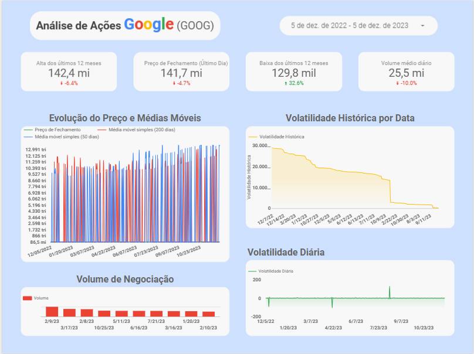

# Análise de Ações do Google (GOOG) com Python e Looker Studio



## ❯ Visão Geral do Projeto

Este projeto apresenta uma análise completa e end-to-end dos dados históricos de ações da Google (GOOG). O objetivo foi realizar todo o processo de um projeto de dados, desde a coleta e limpeza dos dados brutos, passando pela engenharia de features para extrair novas métricas, até a criação de um dashboard interativo no Looker Studio para visualizar os insights e as tendências do mercado.

O projeto demonstra habilidades em manipulação de dados, análise de séries temporais e criação de visualizações de dados eficazes para suportar a tomada de decisões.

**🔗 Acesse o Dashboard Interativo:** [Análise de Ações do Google (Looker Studio)](https://lookerstudio.google.com/reporting/8f839b22-f0f4-4a22-88e2-38b560468476)

* **🔗 Dataset utilizado:** [Kaggle](https://www.kaggle.com/datasets/henryshan/google-stock-price)
---

## 🛠️ Ferramentas e Tecnologias Utilizadas

* **Linguagem de Programação:** Python 3
* **Bibliotecas de Análise:** Pandas, Matplotlib, Seaborn
* **Ambiente de Desenvolvimento:** Jupyter Notebook
* **Ferramenta de BI e Visualização:** Google Looker Studio
* **Formato dos Dados:** CSV

---

## 📈 Metodologia e Processo

O projeto foi estruturado em três etapas principais, seguindo um fluxo de trabalho padrão em análise de dados.

### 1. Extração e Limpeza de Dados (ETL)

O processo iniciou com um conjunto de dados brutos (`GOOG.csv`) contendo o histórico diário das ações. Utilizando a biblioteca **Pandas** em um Jupyter Notebook, as seguintes transformações foram aplicadas:

* **Carregamento dos Dados:** Importação do arquivo CSV para um DataFrame.
* **Conversão de Tipos:** Ajuste da coluna `Date` para o formato `datetime` para permitir manipulação de séries temporais.
* **Preparação para o Looker Studio:** A data foi convertida para o formato `YYYYMMDD` para garantir a compatibilidade e evitar erros de interpretação na plataforma de BI.
* **Exportação:** O DataFrame limpo e enriquecido foi salvo em um novo arquivo CSV (`GOOGLE_limpo.csv`), pronto para ser consumido pelo Looker Studio.

### 2. Engenharia de Features

Para aprofundar a análise, novas colunas e métricas foram calculadas a partir dos dados existentes. Isso permite uma visão mais rica do comportamento do ativo financeiro. As principais features criadas foram:

* **Médias Móveis Simples (SMA 50 & 200):** Calculadas para os períodos de 50 e 200 dias para identificar tendências de curto e longo prazo. Cruzamentos entre essas duas linhas são frequentemente usados como indicadores de compra ou venda.
* **Retorno Diário (Daily Return):** Mede a variação percentual do preço de fechamento de um dia para o outro, indicando a rentabilidade diária do ativo.
* **Volatilidade (50 dias):** Calculada como o desvio padrão dos retornos diários em uma janela de 50 dias. Esta métrica é crucial para entender o risco do ativo.

### 3. Visualização de Dados e Dashboard

Com os dados tratados e enriquecidos, um dashboard interativo foi desenvolvido no **Looker Studio** para apresentar os resultados de forma clara e intuitiva. O painel inclui:

* **KPIs Principais:** Cartões de destaque para Preço Máximo, Preço Mínimo e Volume Médio de negociação no período selecionado.
* **Gráfico de Séries Temporais:** Visualização do preço de fechamento histórico, permitindo observar a evolução do valor da ação ao longo do tempo.
* **Análise de Tendências:** Gráfico sobreposto das Médias Móveis de 50 e 200 dias.
* **Análise de Volume:** Gráfico de barras mostrando o volume de ações negociadas a cada dia.
* **Análise de Risco:** Visualização da volatilidade do ativo ao longo do tempo.
* **Filtro Interativo:** Um seletor de período permite que o usuário analise qualquer intervalo de tempo desejado.

---

## 📂 Estrutura do Repositório

```
├── GOOGLE_limpo.csv                # Dataset final, limpo e com features, pronto para o BI
├── google_stock_prices.ipynb       # Notebook com todo o código de limpeza, análise e engenharia de features
├── README.md                       # Documentação do projeto (este arquivo)
└── assets/
    └── google.png                  # Imagem de visualização do dashboard
```

---

## 🚀 Como Executar o Projeto

Para replicar a análise contida no Jupyter Notebook, siga os passos abaixo:

1.  **Clone o repositório:**
    ```bash
    git clone https://github.com/OYanEnrique/google-stock-analysis-python-looker.git
    ```
2.  **Navegue até o diretório:**
    ```bash
    cd google-stock-analysis-python-looker
    ```
3.  **Instale as dependências:**
    ```bash
    pip install pandas matplotlib seaborn jupyter
    ```
4.  **Abra o Jupyter Notebook:**
    ```bash
    jupyter notebook google_stock_prices.ipynb
    ```

---

## 👨‍💻 Autor

* **[Yan Enrique]**
* **LinkedIn:** [https://www.linkedin.com/in/yanenrique/](https://www.linkedin.com/in/yanenrique/)
* **GitHub:** [https://github.com/OYanEnrique](https://github.com/OYanEnrique)
